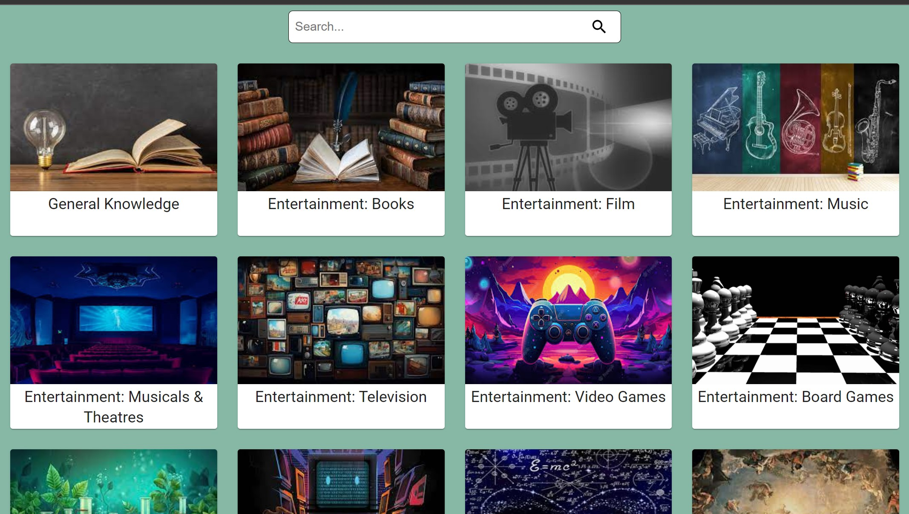
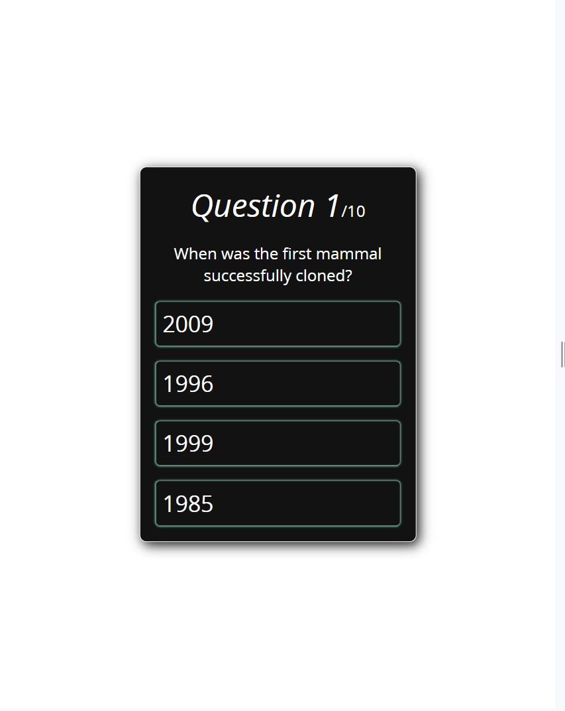

# Quizon
A Trivia quiz app built to bring out the genius in you. Equiped with alot of questions from different categories

## Features

1. Varities of quiz to choose from
2. Easy navigation
3. Responsive and user-friendly
4. Difficulty level you can change

## Technologies, Languages and Tools used

- React
- Redux
- Typescript
- MUI
- Vite
- HTML5
- CSS3
- CSS grid

## Encountered Challenges and future Features

- Working on the backend and database, so that users can login to view their progress

## How to install and run the project

- Fork the project and clone to your local machine
```bash
    git clone https://github.com/MaorBemdoo/Quizon
```
- Redirect to Quizon folder
```cmd
    cd Quizon
```
- Install node dependencies
```node
    npm install
```
- Open the live project on your web browser
```node
    npm run dev
```

## Demo

<div align="center">
    
    
</div>

**[Demo Link](https://quizon.vercel.app)**

## Author

|  |
|:--:|
|Github: [@MaorBemdoo](https://github.com/MaorBemdoo) <br> LinkedIn: [Bemdoo Maor](https://www.linkedin.com/in/bemdoo-maor-449698279/)|

## Support

Give this repo a ⭐ if you like it

## License

This repo is protected by the [MIT](LICENSE) License